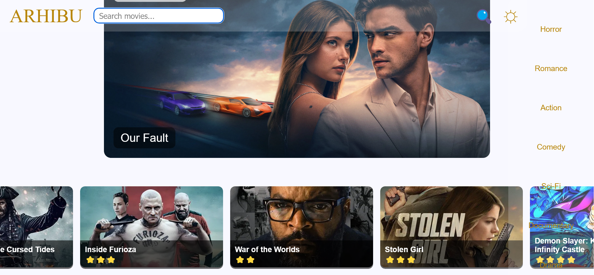

# Arhibu Streaming

Arhibu Streaming is a **movie streaming frontend** built with **HTML, CSS, and JavaScript**, which fetches popular movies, trailers, and genres from **The Movie Database (TMDB) API**. The project demonstrates dynamic content rendering, interactive search, dark mode toggle, and responsive movie cards.

---

## Features

- Display **popular movies** on page load
- **Search movies** by title
- Browse movies by **genre** (Horror, Romance, Action, Comedy, Sci-Fi, Documentary, Drama)
- View **trailers** directly on YouTube
- **Featured movie** section with backdrop image
- **Responsive layout** for desktop and mobile
- **Dark mode toggle** for better visual experience

---

## Screenshots




---

## Demo

You can view the live project on GitHub Pages:  
[**Arhibu Streaming Live**](https://YOUR_USERNAME.github.io/YOUR_REPOSITORY/)

---

## Installation / Usage

1. **Clone the repository**

```bash
git clone https://github.com/YOUR_USERNAME/YOUR_REPOSITORY.git


